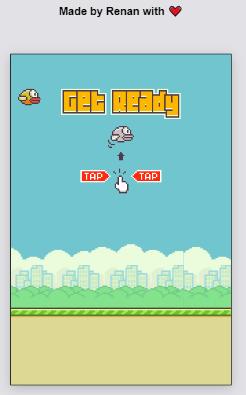

# 🐦 Flappy-Bird

> An clone of a famous game written in Javascript and Canvas.

---


# 🎉 Contributing

[Check this step by step](CONTRIBUTING.md)


# 🛠 Technologies Used

- HTML
- Canvas API
- Javascript

# 👷‍♂️ How to run

```
# Clone repository

$ git clone https://github.com/r3nanp/flappy-bird.git
```

```
# Run in your browser:

Open the index.html file in your browser.
```

# 📸 Screenshot



# 🔗 Link

[Flappy Bird Game](https://r3nanp-flappybird.netlify.app/)
